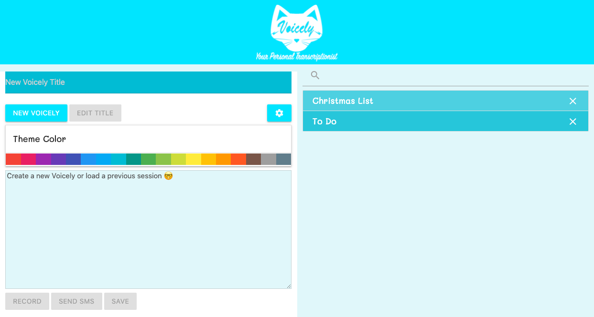

# Project #1: Voicely Speech-To-Text
Voicely is a multi-function speech-to-text note storage web app.
<br>
<br>

## About the authors

| Name | Email  | Github  | LinkedIn |
| :--: | :----: | :-----: | :------: |
| Samuel J. Fox | samueljasonfox@gmail.com | [](https://github.com/samuelfox1) | [](https://www.linkedin.com/in/samuel-fox-tacoma/) |
| Timothy M. Keller | timothy.m.keller@gmail.com | [](https://github.com/tmkeller) | [](https://linkedin.com/in/tim-keller-3ab55bb1/) |
| Chomie Usaneerungrueng | chomieu@gmail.com | [](https://github.com/chomieu) | [](https://www.linkedin.com/in/chomieu/) |
<br>
<br>

## Features

Voicely is a loginless messaging and notekeeping app featuring speech-to-text, SMS capabilities, voice-activated emojis and punctuation, and local data storage.

* Built using Microsoft's Speech SDK.
* Light on dependencies. Uses Google Materialize, JQuery, and vanilla JS, HTML and CSS.
* Responsive UI.
* Customizable theme colors.
* Just say "Voicely _____ symbol" or "Voicely _____ emoji" to dynamically replace the words you say with a corresponding symbol or emoji. Ex: "Voicely smiley face emoji" will remove the text "Voicely" and "emoji" and replace "smiley face" with a 🙂 symbol.
* Queries the Emoji API for a list of emojis for text replacement, but also maintains a stored copy.
* Uses the ClickSend API to send SMS messages to chosen phone numbers.
* Uses custom modals instead of alerts, prompts, or confirms.
* Voicely files are saved to localStorage, which populates a list to be retrieved at the user's leisure.

<br>
<br>

## User Story

```
AS AN internet user with limited ability to use my hands
I WANT a way to take notes, make lists, and send messages that requires limited hand usage
SO THAT I can communicate with friends and coworkers, and save important notes for myself
```

## Acceptance Criteria

```
GIVEN a blank text area and interface
WHEN I press the New Voicely button
THEN a file is created in localStorage that can be edited and accessed at will
GIVEN a dashboard with text inputs
WHEN I record a voice message
THEN the speech is converted to a saveable text item
GIVEN a text field
WHEN I use the Voicely ____ symbol/emoji speech tag
THEN I get the corresponding emoji or symbol added to my speech-to-text results
GIVEN a button for sending an SMS
WHEN I press it and input a phone number
THEN my text area content is delivered
```

## Product

[Live Site URL](https://chomieu.github.io/Project-1/)


<br>
<br>
## Technologies


<br>
<br>
## License

[CC0 1.0 Universal](https://creativecommons.org/publicdomain/zero/1.0/)
